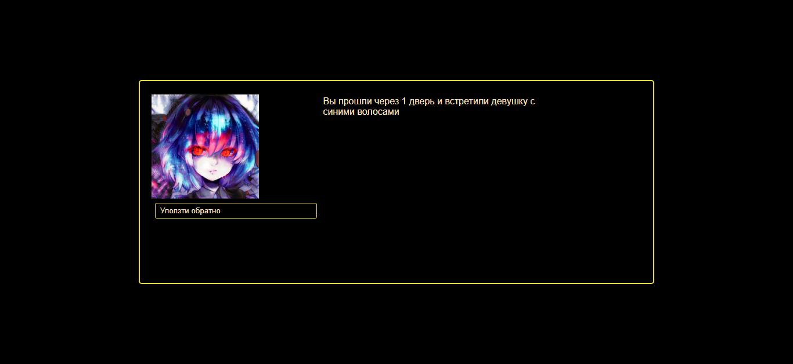

[Ссылка на игру](https://alexeysay.github.io/Dialog-Game.github.io/)
<h1 align="center"> Dialog-Game </h1>

## Мотивация: Было скучно

## Функционал
- Последовательности и разветвления диалогов прописаны в dataTable.csv(вручную конвертируется в json и в data.js)
- Выбор ответа до 4 вариантов, влияния которых описаны в dataTable.csv
- Изображение-аватар для персонажей